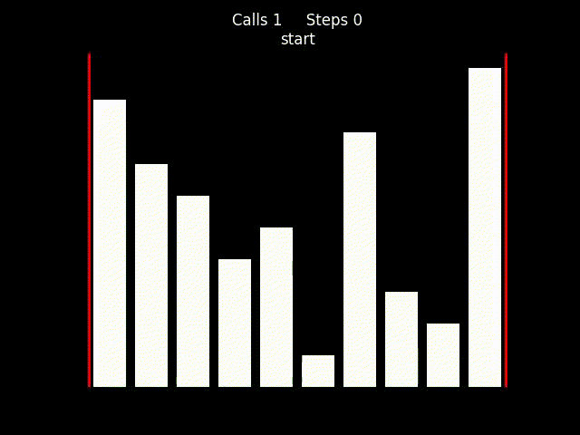
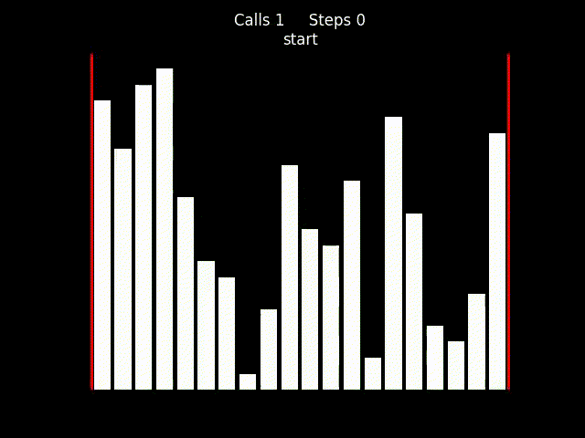
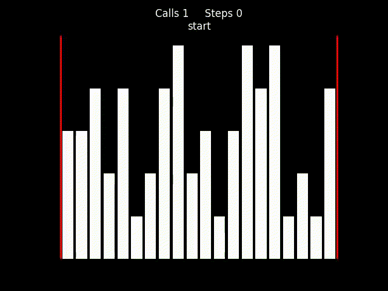
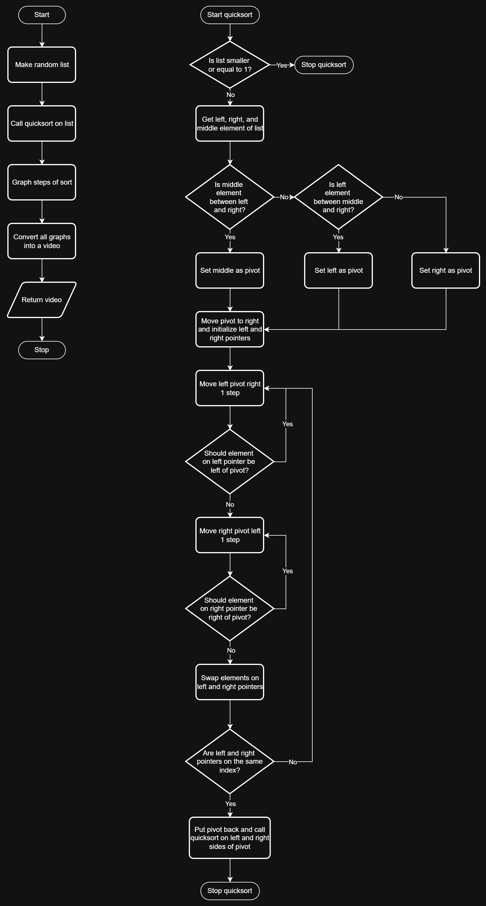

# Quicksort Visualization
Renders videos of quicksort

## Demos
[Demo video](https://www.youtube.com/watch?v=3H7URR-TYTU)

## Problem Breakdown & Computational Thinking
I was inspired by sorting videos online where they represent sorting algorithms as bars and beeping sounds. I chose the quicksort algorithm because I thought it would be the most interesting to be visualized this way. 

To make the quicksort algorithm I’m going to use the two pointer version with the median of three method for the pivot. 

To get the median of three, I first get the elements on the left, right, and middle. I can use if statements to quickly get the median of the 3 elements. 

Once I get the pivot I’ll move it to the right to get it out of the way so I can use a left and right pointer to move from the outside towards the inside. As the pointers move they will swap elements if the elements are on the wrong side by comparing it to the pivot. Once they reach each other the pivot is moved back and quicksort is called 2 times, one on the left side of the pivot and one on the right side. This keeps going until the section the quicksort is sorting is smaller or equal to one. 

During this I will store each state of the list as it’s being sorted in another list to display later. 

Once the sorting is done I will plot each state of the array in a bar graph so that it looks like those sorting videos. Then I just have to display those graphs one by one, such as converting all of the graphs into a video. 

## Steps to Run
Use sliders and checkbox to customize sort then press the Render Sort button. 
Render times can range from 10 seconds (size=10) to 200 seconds (size=100). 

## Hugging Face Link
`https://huggingface.co/spaces/BigShoe/QuicksortVisualization`

## Author & Acknowledgment
Written by Yang Hsiu Su

### Sources Used
`https://stackoverflow.com/questions/57316491/how-to-convert-matplotlib-figure-to-pil-image-object-without-saving-image`

`https://stackoverflow.com/questions/44660676/python-using-multiprocessing`

`https://stackoverflow.com/questions/52414148/turn-pil-images-into-video-on-linux`
